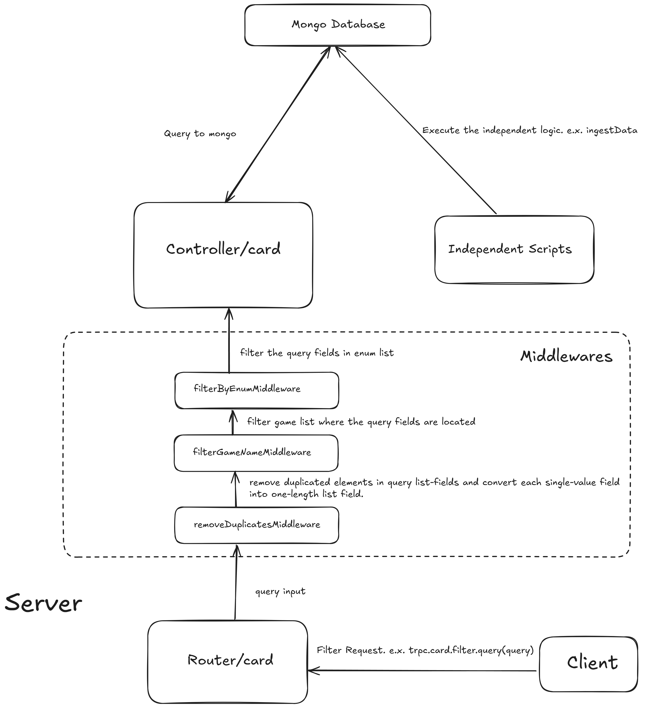
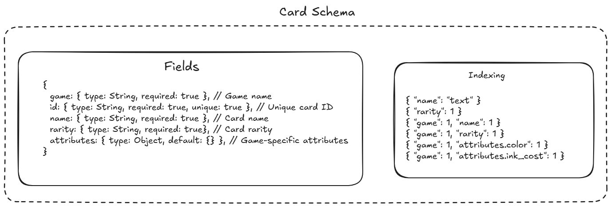

# CardNexus Coding Challenge

## Overview

server/client with [tRPC] for ingesting and querying TCG data.

## How to start Project

## Project Architecture



## Data Modeling / Indexing



## Query Logic

### Input Format

- game: One or more selected values for enum "mtg", "lorcana"
- name: String
- rarity: One or more selected values for enum list of "mtg", "lorcana" rarity , such as "common", "mythic", ... , "Common", "Enchanted", ...
- color: One or more selected values for enum list of "mtg" color, such as "U", "B", ...
- ink_cost: One or 2 numeric comparisons for "lorcana" ink_cost

```bash
Example Input:
{
    game: ["mtg", "lorcana", "lorcana"],
    name: "so",
    rarity: ["Uncommon", "Common", "Common", "common"],
    ink_cost: [3, 6],
}
```

### MiddleWares

Middlewares <u>refactors/optimizes</u> the user-input query.

- removeDuplicatesMiddleware: Remove duplicated elements in query list-fields and convert each single-value filed into one-length list field.

  ```bash
  Example Output:
  {
    game: ["mtg", "lorcana"],
    name: ["so"],
    rarity: ["Uncommon", "Common", "common"],
    ink_cost: [3, 6],
  }
  ```

- filterGameNameMiddleware: Filter game list to get the game names which have the fields in query.

  ```bash
  Example Output:
  {
    game: [ 'lorcana' ],
    name: [ 'so' ],
    rarity: [ 'Uncommon', 'Common', 'common' ],
    ink_cost: [ 3, 6 ]
  }
  ```

- filterByEnumMiddleware: filter the query fields by enum list in expected Card fields.

  ```bash
  Example Output:
  {
    game: [ 'lorcana' ],
    name: [ 'so' ],
    rarity: [ 'Uncommon', 'Common' ],
    ink_cost: [ 3, 6 ]
  }
  ```

### Query in Controller

Construct the query in controller

```bash
Example Query:
{
  game: 'lorcana',
  name: { '$regex': 'so', '$options': 'i' },
  rarity: { '$in': [ 'Uncommon', 'Common' ] },
  'attributes.ink_cost': { '$gte': 3, '$lte': 6 }
}
```

## How to start Project

### Requirements

- Node >= 18.0.0
- MongoDB

### Install dependencies

```bash
npm install
```

### Env Setup

- Set the `PORT` to 5000, The project runs on port 5000 by default. To change according to the preference, set it on `.env` and change the port of `dev:client` in `package.json`.
- Set the `MONGO_URI` to your own URI.

### Run server/client

```bash
npm run dev
```

If all dependencies have been installed successfully, you will receive the message `yay!` on client side.

### Ingest Data

```bash
npm run ingest
```

It ingests the TCG data to mongodb, it creates the `cards` collection.

### Test Server Endpoints

```bash
npm run test
```

It tests the server endpoints through Jest. You can change the test data in `src/client/test-data.ts`.

## Commands

```bash
npm install             # install dependencies
npm run ingest          # ingest TCG data and insert on mongodb
npm run dev:server      # start server
npm run dev:client      # start client
npm run dev             # start server/client
npm run test            # test server endpoints
```

## How to Add the New Attribute/Game

This makes easy to add the new attribute/game, just by modifying `src/server/config/db.config.json`.

### Add the new attritbue

- Go into `src/server/config/db.config.json`.
  Please have a look at `src/server/types/DBConfig/DBConfigInterface` to get to know the required type of `db.config`.
  - If you want to add a common attribute (attribute that all games have, e.x. `name`, `rarity`), add it into `commonAttributes` and specify the properties such as `type`, `required` and `unique`. Even if the common one, if there is the game specific properties (e.x. `rarity` is common, but there is the completely different enum list.), specify it into `gameSpecificAttributes` too.
  - If you want to add a game specific attribute (e.x. `ink_cost`), add it into `gameSpecificAttributes:${gameName}` (e.x. `gameSpecificAttributes:lorcana`) and specify the properties.
- Update the `input` of the filtering endpoint in `src/server/routers/card.ts`.
- Update the filtering controller in `src/server/controllers/card.ts`.

### Add the new game

- Go into `src/server/config/db.config.json` add the new game fields into `gameSpecificAttributes:${newGameName}`. Also you might to need to add the data path in `gameDataPaths:${newGameName}`.
- Ingest the data by running `npm run ingest`.

## Future Improvements

- In this project, we have to update/create the input validation of the filtering endpoint whenever new attribute/game is added. So we might need to create the new util that creates the input validation based on the TCG card schema.
- We have to type the logic that creates the db query, but we might need to create the new util that creates the db query based on the TCG card schema. As it grows, we might need to change the order of keys in a query in `src/server/controllers/card.ts:filterCard`.
- For now, I didn't implement the upsert while ingesting, we might need to implement the upsert.
